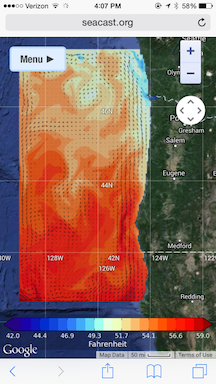
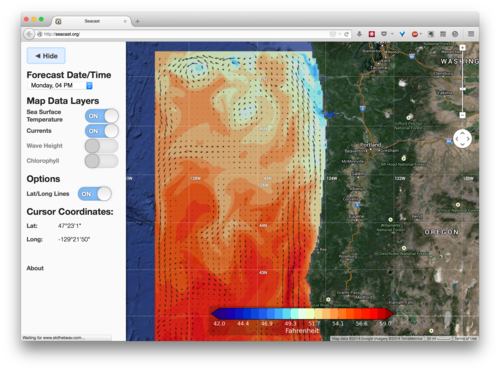

# Seacast

## About <a name="About"/>

Seacast.org is a Django site created by students at Oregon State University for the College of Earth, Oceanic, and 
Atmospheric Sciences. It takes oceanic models and uses Matplotlib, Basemap, and Celery to plot them as Google Maps 
overlays, with the goal of helping Oregon's coastal fisherman find fish more easily.

We have a staging server at [staging.seacast.org](http://staging.seacast.org), and we just deployed to production 
at [seacast.org](http://seacast.org).

Mobile:


Desktop:


## Table of Contents <a name="Contents"/>

1. [Quick Start Installation](#QuickStart)
2. [PyCharm Set-up](#PyCharmSetup)

<a name="QuickStart"/> ## Quick Start Installation

All these requirements should be cross platform. If you're on Windows, you can also use the Git Bash for these 
over Command Prompt (lets you use Linux-based commands). Throughout these steps are mentioned the project directory, 
which is the directory that you clone from GitHub that contains manage.py and the hidden .git directory. anything 
you see below in italics is a command that can be entered via the commandline. if you run into an error, 
there is a list of common problems that we encountered during the setup process near the end of this document in the 
“common problems” section.

1. Seacast uses the following as dependencies:
    1. Python 2.7 for you system if it doesn't already have it
        * If you're on Windows ensure you select the option to add Python to your PATH so you can use it from
        the command line and don't have to enable it later
    2. Pip if you do not have it - https://pip.pypa.io/en/stable/installing/
    3. Git - https://git-scm.com/downloads
    4. Vagrant -  https://www.vagrantup.com/
    5. Vitural Box - https://www.virtualbox.org/wiki/VirtualBox
    6. Some kind of IDE. We suggest PyCharm the community edition since its free and has nice PyCharm Support.
    Atom or Submline are other good choices.
    7. Some kind of SSH Client (Putty works well) - http://www.putty.org/
2. Installation And Set-Up
    1. In the folder of your choosing, create a ```Seacast``` folder. Inside this folder you will clone the repository
    and include other folders that will act as the shared folder between the vitural machine and your computer.
        Note: A good place to put this folder is within your base C Drive. Our fab file isn't the most robust
        and will error if there is a space in a directory path, so if your user name has a space in it
        (ie "John Doe") then place the folder within your C Drive.
    2. Create a folder named ```media``` in the ```Seacast``` folder. 
    3. Clone this repository into the ```Seacast``` folder:
        ```>>> git clone https://github.com/Seacast/SharkEyes.git sharkeyes```

        * Note Due to how our fabric file works if you have a space in your windows folder name the script won't 
        complete. To avoid this clone the repository into the base C:// Drive
    4. Add the Centos Box to Vagrant and Virtural Machine
        ```>>> vagrant box add centos65 https://github.com/2creatives/vagrant-centos/releases/download/v6.5.3/centos65-x86_64-20140116.box ```
        This will add the Centos box that Seacast Uses to run its development server on.
    5. Create the Vagrant Box
        ```>>> vagrant init centos65```
    6. Install Fabric
        ```>>> pip install fabric```
3. Create a new settings_local.template file and add passwords for your vagrant box.
    1. Copy the *settings_local.template* file and rename it as *settings_local.py*
    2. Edit the following fields in *settings_local.py*
    
        Field To Edit   | Edit To Be 
        ----------------|:-----------:
        BROKER_PASSWORD | Any Password
        PASSWORD        | Any Password
        SECRET_KEY      | 40 Character ASCII String
        DEBUG           | TRUE
        TEMPLATE_DEBUG  | TRUE
       
    3. (Optional) Edit the following fields if you want to update and test the feedback system.
        
        Field to Edit       | Edit To Be
        -------------------:|:-----------:
        EMAIL_HOST_USER     | Any Email Address
        EMAIL_HOST_PASSWORD | The password for that Email Address
        RECIPEIENT          | Any Email Address
        
4. Vitural Machine Start Up and Provisioning
    Now that we've created our Vagrant Box, cloned the respoitory and installed fabric, we can now start to 
    provision the vitural machine. WARNING: This process takes time and requires baby sitting. Be ready to spend
    at least a few hours installing.
    1. ```>>> vagrant up``` 
        This will start the vagrant Machine. You should see some dialog from the vagrant machine
    2. You can now SSH into your Vagrant Machine by SSHing into 127.0.0.0:22 or by typing:
        ```>>> vagrant ssh```
    4. Install kernel-dev file.
        ```>>> sudo yum install -y kernel-devel.rpm```
    4. Provision the Vagrant Machine
        ```>>> fab vagrant provision```
    5. Set-Up MySQL
        The script will ask for your to set up the root password for MySQL. Create a password
        and write this down so that you can remember it. For the other passwords they will be the passwords you
        specified in your settings_local.py file. For all other settings of MySQL say `yes'.
        * If this part fails, or you need to redo this part you can ssh into in the machine and delete the
        file ```mysql_setup_script_run.guard``` in ```/opt/sharkeyes/src/config```
    6. Wait for provisioning to complete.
5. Start the development server
    Once provising has completed starting the development server is a good way to ensure that everything was
    installed correctly. To start the development server run the following command:
    ```>>>fab vagrant runserver```
    
    Then you can navigate to ```localhost:8001``` and you should see the development server.
    
    If you don't see the development server you may need to forward the port on your vagrant box: you can do that
    by adding the following to your Vagrant File: ```config.vm.network :forwarded_port, guest: 8000, host: 8001```
        
### PyCharm Setup <a name="PyCharmSetup"/>
    
#### Community:

#### Proffessional:

If you have a subscription to the proffesional version of PyCharm you can follow the directions below to configure
its ability to use Django.

NOTE: These instructions might be out of date.

1.  From PyCharm go File->Open and choose the project directory. It should recognize stuff, give it a chance to do that.
2.	Then you need to setup the project interpreter to use the interpreter in your virtual machine. Make sure the VM is up before doing this:
3.	Go to PyCharm Preferences -> Project Interpretor
4.	Click the gear to the right of the Project Interpeter bar, and then remote, and then the 'vagrant' radio button. If it asks, your vagrant instance folder is the project folder.
5.	In the Python Interpreter Path put /opt/sharkeyes/env_sharkeyes/bin/python
6.	Then click ok. It'll connect to the vagrant instance and learn what's installed there, which might take a minute or two.
7.	Then go to PyCharm Preferences -> Django.
8.	Check the box to enable Django.
9.	The project root is your project folder. Point 'Settings' at settings.py, and point 'Manage script' at manage.py. These are both relative to the project root.

10.	Then setup the site configuration to run the project from within PyCharm:
11.	At the top of the PyCharm window there’s a play button and a down arrow to the left of it. Choose that, and then 'edit configurations'.
12.	Set the host to 0.0.0.0, and the Port to 8000.
13.	Check 'no-reload' so that it doesn’t automatically reload when you change code. Or don't if you want it to do that.
14.	Make sure that the python interpreter is the remote one you made earlier.
15.	Set two environment variables by clicking on the ... to the right of the field.
16.	set DJANGO_SETTINGS_MODULE equal to SharkEyesCore.settings
17.	and set PYTHONUNBUFFERED equal to 1.
18.	And add a path mapping where the local path is your project folder, and the remote path is /opt/sharkeyes/src.
19.	This should be everything. You should be able to hit run, and get then go to localhost:8001 in your browser and see the project home page. If you get a page reset message, try refreshing a few times. If you want to debug, set a breakpoint and hit the bug to the right of the play button.


